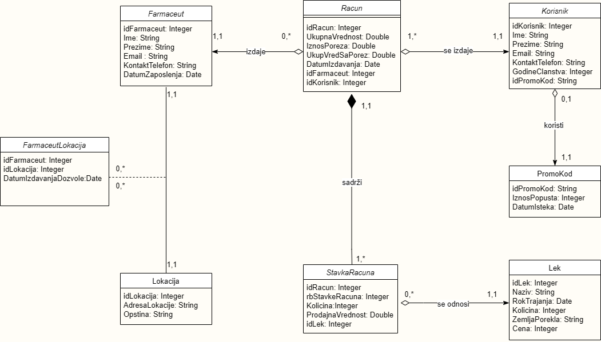
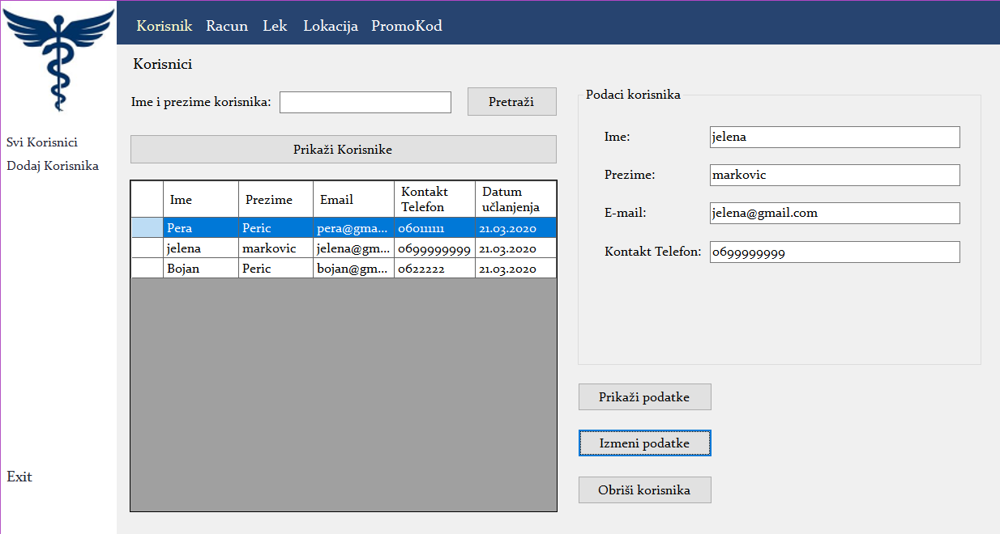
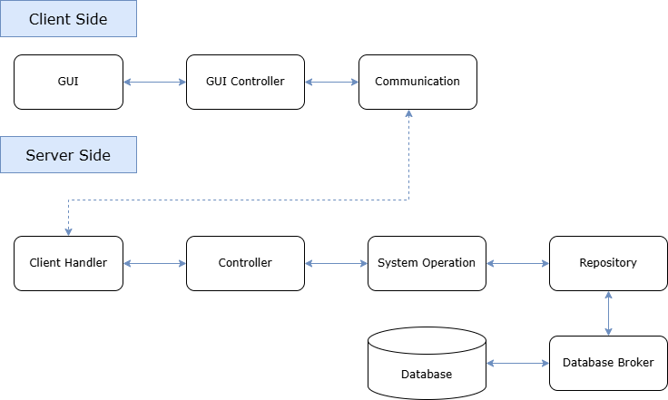

# About the project (WIP)

A comprehensive desktop application designed to streamline and manage operations in pharmacy retail environments.
Built with C# Windows Forms, following a multi-layer architecture with client-server communication.

Larman's software development methodology has been followed for successful development of this project, featuring five key stages:

- Requirements definition stage
- Analysis stage
- Design stage
- Implementation stage
- Test stage

## Analysis Stage



From the _Conceptual Model_, I derived the _Relational Model_ for the database:

```
Farmaceut (#idFarmaceut, Ime, Prezime, Email, KontaktTelefon, DatumZaposlenja, KorisnickoIme, Lozinka)

Lek (#idLek, Naziv, RokTrajanja, Kolicina, ZemljaPorekla, Cena)

PromoKod (#idPromoKod, IznosPopusta, DatumIsteka)

Lokacija (#idLokacija, AdresaLokacije, Opstina)

Korisnik (#idKorisnik, Ime, Prezime, Email, KontaktTelefon, DatumUclanjenja, GodineClanstva, idPromoKod) 

Racun (#idRacun, UkupnaVrednost, IznosPoreza, UkupnaVrednostSaPorezom, DatumIzdavanja, idFarmaceut, idKorisnik)

StavkaRacuna (#idRacun, rbStavkeRacuna, Kolicina, ProdajnaVrednost, idLek)

FarmaceutLokacija (#idFarmaceut, idLokacija, DatumIzdavanjaDozvole)
```

## Design Stage

At this phase, I designed forms and user controls for each use case. Here is an example _examples_ of the forms I created.



## Implementation Stage


### Project Structure

```
PharmacyApp/
├── ApplicationLogic/     # Business logic and system operations
├── Common/               # Data Transfer Objects
├── DatabaseBroker/       # Database access layer
├── Domain/               # Business entities and concepts
├── Server/               # Server application
├── Storage/              # Repository implementation
├── SystemOperations/     # Atomic business operations
└── View/                 # Windows Forms UI
```

### Project Architecture


